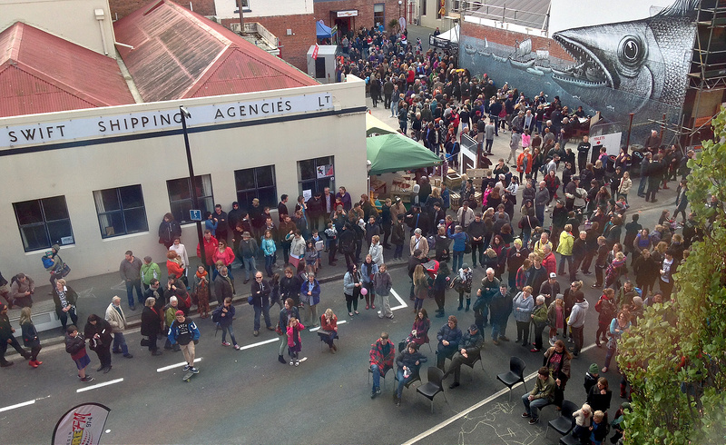
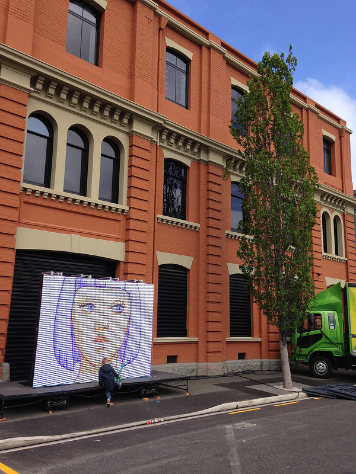
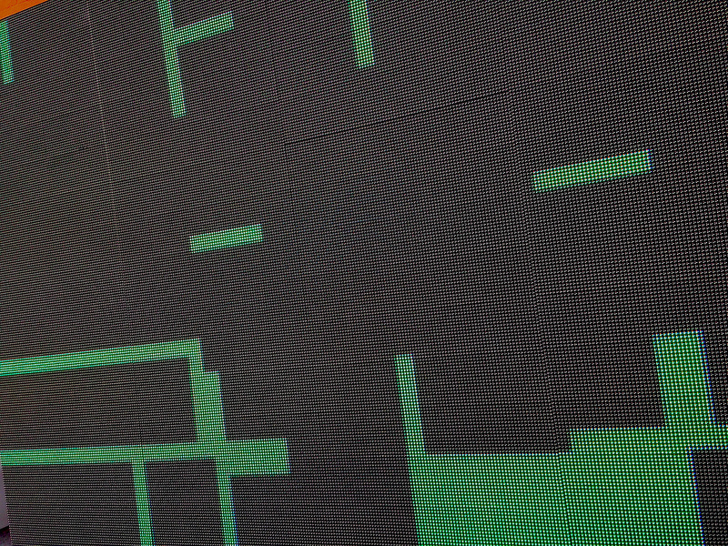

In 2014 the first Vogel Street Party happened in the warehouse precinct in Dunedin. The reason for the party was to celebrate the local community making things happen &amp; the general rejuvenation of the area.

<!-- wp:image {"id":240,"align":"right","width":300,"height":400} -->

<!-- /wp:image -->

It was incredible!

From 3pm to 10pm on Saturday the 18th of Oct 2014:

- the street was closed to traffic
- street food vendors sold delicious wares
- a huge range of activities for young and old were held
- a HUGE LED wall screen showed animation, video and digital art
- musicians performed over the afternoon
- there was an upcycled street-fashion show
- DJs played into the evening

<!-- wp:image {"id":241,"align":"right","width":600,"height":450} -->

<!-- /wp:image -->

Also the party coincided with the [Dunedin Street Art](http://dunedinstreetart.co.nz) Festival. Local and international artists transformed walls around the area into vibrant pieces of art.

A strong group of volunteers made this happen. I got myself involved from day one and put a lot of energy into the website, booking the DJs, as well as curating &amp; producing the digital screen content.

I also had the privilege of performing - DJing and triggering custom synchronised animations on the big screen.

A huge thanks to everyone who contributed to the event, and the sponsors who backed us!

---

*This post was originally posted in 2014; since then there have been more Vogel Street Parties every year (with a hiatus in 2018), each one getting bigger and better! See you at the next one :)*