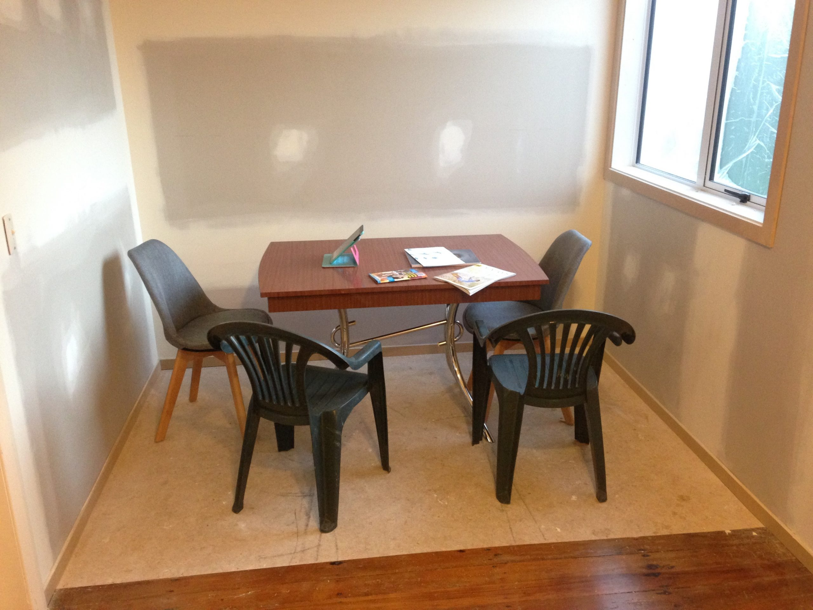
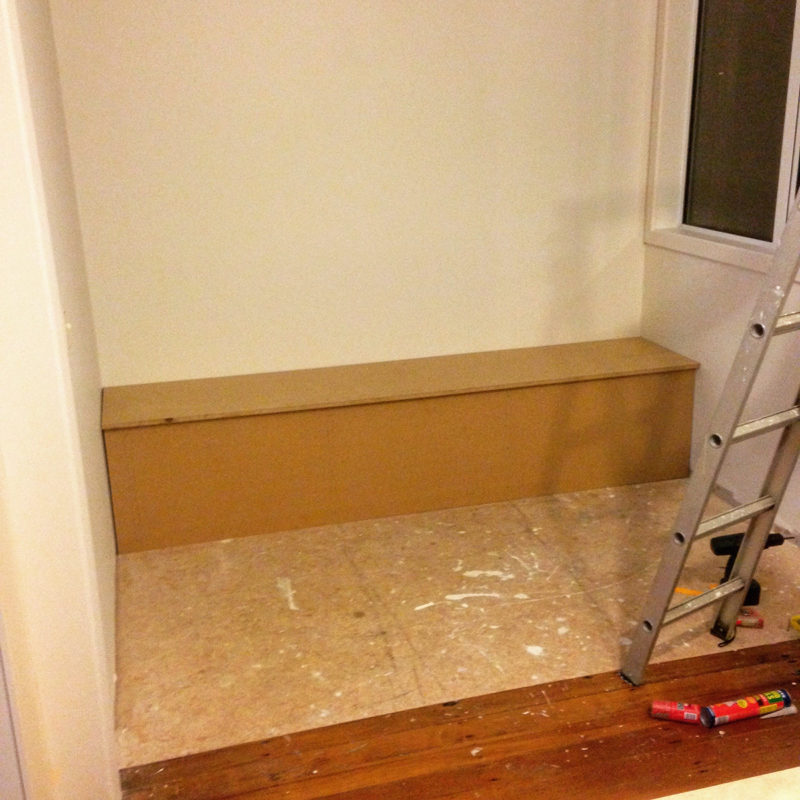
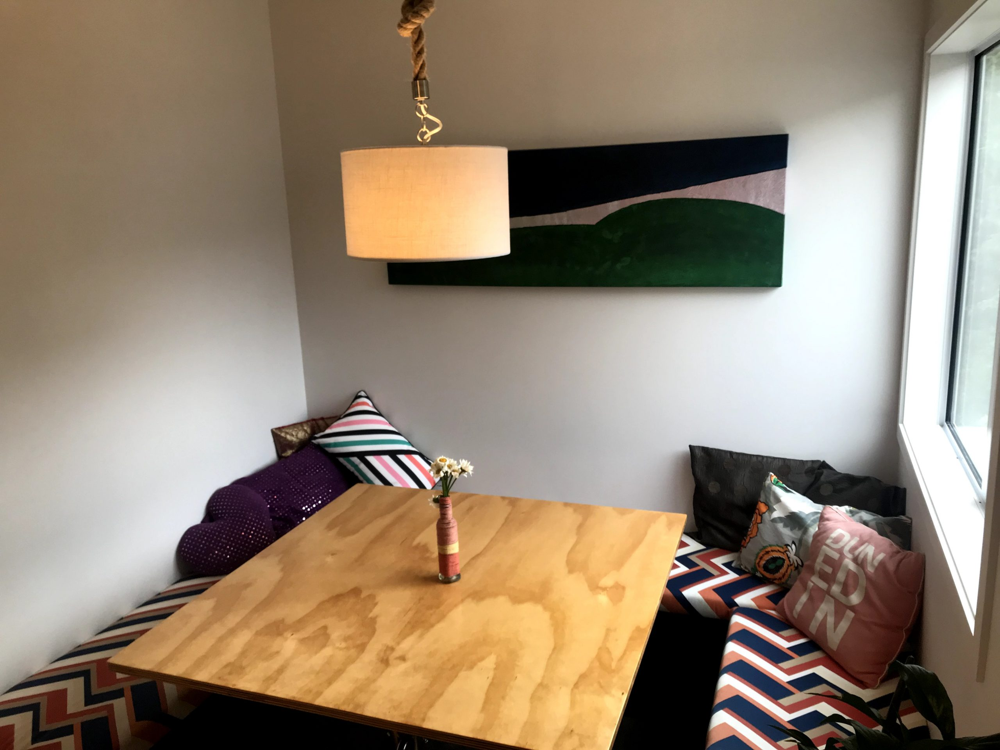

A little while ago we had some work done on our house to make it better.

We swapped the windowless, dank bathroom out to the large sun-filled laundry (with a vaulted/angled ceiling), extended the hallway to the back of the house, and added a toothbrush nook.

Next to our kitchen there was a nice chunk of space, with a view out to the back yard (and forthcoming deck). I was really keen on turning this into a dining booth – a bit like a cafe/diner booth, but a bit bigger.

So I borrowed a circular saw, started measuring, and built it!

<!-- wp:jetpack/tiled-gallery {"ids":[265,266,null,null,null,null,null,null,null]} -->

<!-- /wp:jetpack/tiled-gallery -->

