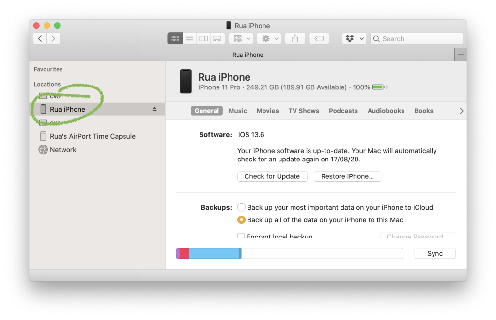

<!-- wp:soundtrack/playbutton -->
Play

<!-- /wp:soundtrack/playbutton -->

*This page has a musical soundtrack - click the **Play** button to hear it as you scroll.*

<!-- wp:soundtrack/loop {"audioUrl":"https://haszari.cartoonbeats.com/wp-content/uploads/2020/08/20200814-135bpm-maenyb-rubadub-chordsstrings.mp3","audioTitle":"Redline Train Rubadub (chords \u0026 strings)","audioArtist":"Haszari","loopLengthBeats":32} -->
Haszari – Redline Train Rubadub (chords &amp; strings)

<!-- /wp:soundtrack/loop -->

I like default settings .. but I also like to customise things. Especially my sound world. It's quite possible to get a custom [ringtone on an iPhone](https://support.apple.com/en-us/HT207955), though it's a bit of a hidden feature. I'm not sure about other phones (e.g. Android) - let me know how that works in the comments.

If you just want to download my new dub-reggae ringtone, scroll down!

## How

<!-- wp:soundtrack/loop {"audioUrl":"https://haszari.cartoonbeats.com/wp-content/uploads/2020/08/20200814-135bpm-maenyb-rubadub-drumbass.mp3","audioTitle":"Redline Train Rubadub (drums \u0026 bass)","audioArtist":"Haszari","loopLengthBeats":32} -->
Haszari – Redline Train Rubadub (drums &amp; bass)

<!-- /wp:soundtrack/loop -->

I make my ringtones on my laptop - because that's where I make music and wrangle all my samples. You can also do this on an iPhone (details below).

- Make or record some audio less than 30 seconds in duration.
- Encode it as aac (.m4a) format.
- Rename the file .m4r (ringtone) format.

Then, connect your phone to your laptop via USB. In recent versions of macOS you should see your phone in the finder sidebar:

You'll notice there's no mention of ringtones anywhere here.

**BUT** you can **drag your .m4r files over** and drop them and they will show up on your phone!

📱🎉😃

### How to make a ringtone – right on your iPhone

Without a laptop, it's a similar process, using *GarageBand* on iOS.

- Open GarageBand on your phone, start a new project.
- Make or record less than 30 seconds of sound/music.

This is the tricky bit, one reason why I prefer desktop.
- Share song and select Ringtone.

## Why make custom ringtones?

I like making music but like a lot of creatively minded people I can get bogged down polishing things to perfection. Or feel paralysed by the many half-finished projects or the long list of ideas.

Producing and rendering ringtones is a way of focusing on a low-stakes outcome. Also it's a fun way to road-test ideas - if you still like it after using it as a ringtone, maybe it's a keeper!

## Free download

<!-- wp:soundtrack/loop {"audioUrl":"https://haszari.cartoonbeats.com/wp-content/uploads/2020/08/20200814-135bpm-maenyb-rubadub-all.mp3","audioTitle":"Redline Train Rubadub","audioArtist":"Haszari","loopLengthBeats":32} -->
Haszari – Redline Train Rubadub

<!-- /wp:soundtrack/loop -->

My new ringtone is a more laid-back, casual "rubadub" style version of *Redline Train* - an unreleased dub reggae tune. It's the soundtrack for this page!

You might have already heard the song - [it's part of Padded Landscape](https://cartoonbeats.com/padded-landscape/), my [continuously-evolving loop-based audiovisual installation &amp; website](http://landscape.cartoonbeats.com).

When someone rings me, this gentle reggae ditty will echo through my surroundings as I scrabble to answer my phone. When you send me a text, a little dubby chord stab alerts me about this!

[Download the files](https://haszari.cartoonbeats.com/wp-content/uploads/2020/08/Haszari-Redline-Ringtones.zip) and drag them on to your phone – this archive includes .m4r files for iPhones and .mp3 files which should work on other devices (e.g. Android, Samsung). Let me know if your phone uses some other format.

<!-- wp:buttons -->
[Download the Redline Train Rubadub ringtone pack](https://haszari.cartoonbeats.com/wp-content/uploads/2020/08/Haszari-Redline-Ringtones.zip)

<!-- /wp:buttons -->