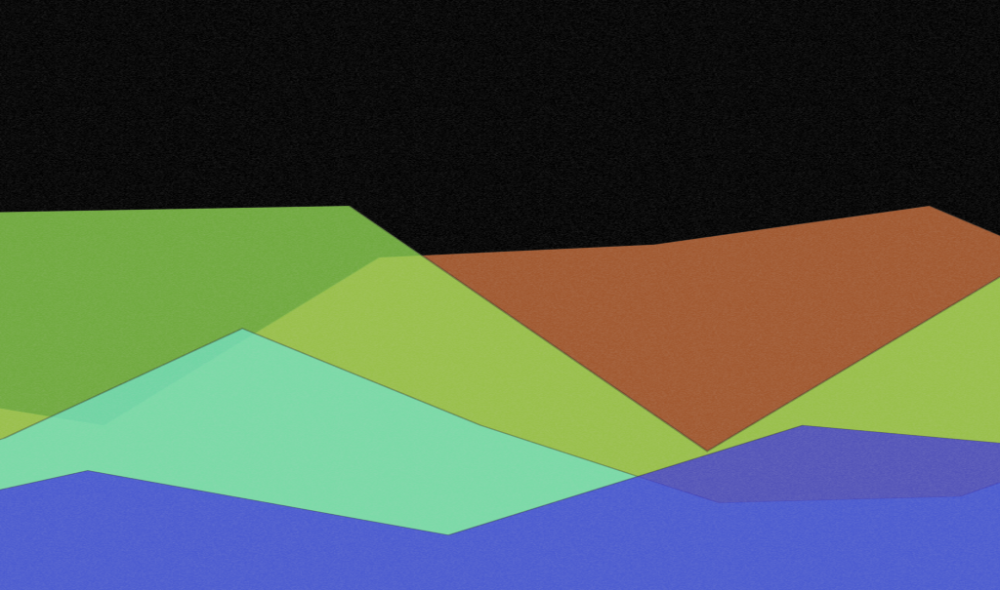

*a loop-based generative audio-visual experiment*

<!-- wp:buttons {"layout":{"type":"flex","justifyContent":"center"}} -->
Click here to launch site, click play button, wait …

<!-- /wp:buttons -->

A while ago I decided to relax a bit more with my music production. The idea was to remove the pressure to finish and release tracks, and just noodle around and make loops. If I had fun jamming, I'd render the parts as a loop, archive it, and move on.

It was really liberating to focus in on short sections of music, and not concern myself with arrangement.

I might set out to make an ["east coast whine"](https://www.youtube.com/watch?v=kPJNfnWth4o) sound, and end up with a little trap/hip hop loop (*Kufca*). Or I might want to make a classic ["synth strings"](https://www.soundonsound.com/techniques/synthesizing-strings-pwm-string-sounds) sound, and then turn that into a vocal-sample driven 90s big-beat loop (*Mivova*).

Around the same time, I was [experimenting](https://github.com/haszari/kytaime) with the [Web Audio API](https://developer.mozilla.org/en/docs/Web/API/Web_Audio_API). It's really powerful, making it easy to slice up audio files, sequence audio and midi, and even build custom synthesis and effects processing.

I've also been dabbling in ways to combine audio and (primitive) animation. Wouldn't it be cool to jam out on a sequencer or midi controller, and synthesise visual and audio content at the same time?

## How the audio works

There are currently nine songs/loops of material set up. Each song is divided into four stem parts – sometimes a single instrument (drums, bass, or vocals), sometimes a combination.

I've named the different mix layers using words that you might use to navigate a mountainous landscape:

- alpine - typically drums
- ridge - typically bass
- uplands - lead, chords, synth
- hills - vocals, texture, arpeggio, pad

These aren't hard &amp; fast categories; for example, some songs have different drum patterns in alpine and ridge. The idea here is that if you combine say a ridge and alpine from one song and hills from another, it won't sound terrible :)

The playback is automated and has some gentle randomisation so it's not exactly the same each time.

- Playback happens in 64 beat cycles.
- The order of the songs is shuffled. 🗂
- For each song, a part is selected at random in each cycle, until all parts are playing.
- Then the parts are removed in a random order.
- When there's only one or two parts of the outgoing song playing, a new song kicks in. This means parts from two different songs will overlap – like a DJ blend.
- Each part might fade in or filter in slowly over the cycle, or start fully turned up. Similarly, parts may fade or filter out. 🎛
- When we run out of songs, we shuffle the order and start again. 🎲

To add a little punctuation &amp; spice to this, I've added in a handful of sound effects. Some are recordings of cutting card or ripping paper, but there's also an [airhorn](http://www.instantrapairhorn.com). These are randomly sprinkled on cycle changes, especially if a song is changing. These are fed into a dub-delay effect.

There are also some texture samples – maybe birds, a dripping tap, the ocean, or sea scouts around a campfire. When the song changes, a beat-synched chunk is sampled and looped from one of these textures, to add another layer to the transition.

The mixing and effects processing happens live in your web browser, using Web Audio nodes - filters, delays.

## How the animation works

The mountains are [React](https://reactjs.org) components containing [SVG](https://en.wikipedia.org/wiki/Scalable_Vector_Graphics). There are four mountain ranges, to match the four mix layers. If a ridge (e.g. a bassline) part is playing, you'll see a moderately tall mountain range. When parts fade in or out over the cycle, the mountains fade in too.

Each mountain is an SVG polygon, and the points are animated, parallax-scrolling style. There's a [codepen prototype here](https://codepen.io/haszari/pen/LLpzeq).

When a song comes in, random colours are picked for the front (hills) &amp; back  (alpine) range. The intermediate two colours are interpolated.

## What next?

Occasionally I may add new songs to Padded Landscape. One song will get released on [Cartoon Beats](https://cartoonbeats.com/releases/) later this year – *Redline Train*, based on the *Maenyb* dub / reggae loop. Keep an ear out for it - this will include a remix from **[nsu](http://newclearmusic.bandcamp.com)** (of Newclear Music).

If you need a low-maintenance soundscape… [fire up the site and click play](http://landscape.cartoonbeats.com)!

