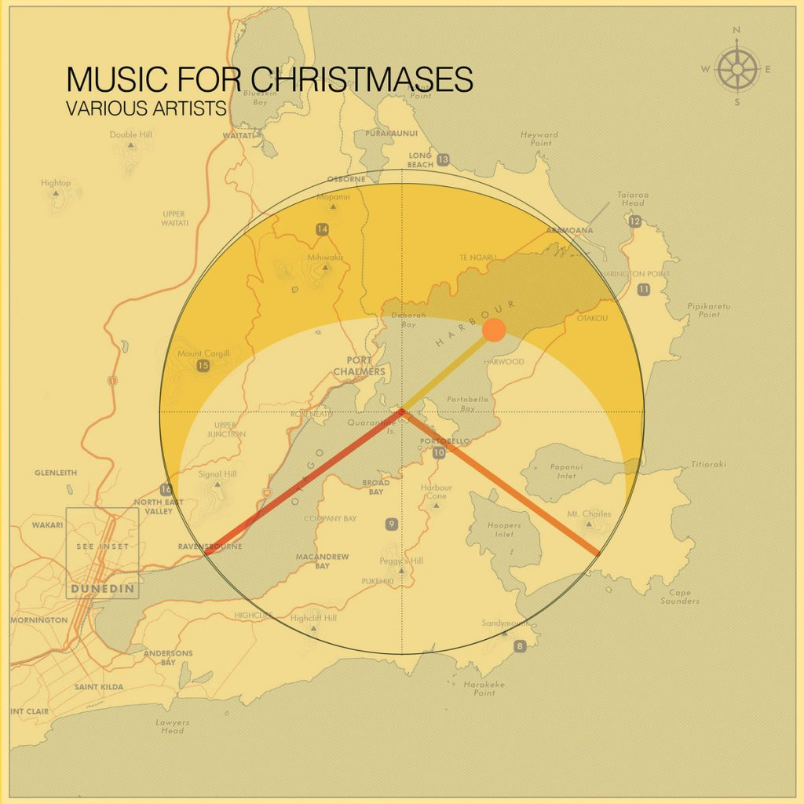

A couple of months ago, on the drive back from Kaka Point, a cyclic melody came into my head. This happens sometimes, when my mind is free-wheeling, in the groove of driving.

<!-- wp:columns -->
Although I claim to be a dedicated hobby musician, the amount of "music" (melodic material) that I "write" is pretty small these days. So I seized on this opportunity - i.e. asked Jill to record me singing the tune (with my phone.

We were driving back from one of our infrequent trips to [check  progress on our build](https://taratakaka.wordpress.com). The progress this time involved one of the most wonderful materials in this world – cast concrete. We had a foundation!

click play to hear me mumbling the germ of a tune against a foundation of road noise

<!-- /wp:columns -->

I've always loved dub and I'm starting to get a better feel for producing it ([see also Redline Train](https://cartoonbeats.com/product/redline-train/)).

As soon as we arrived home, I hid in my office and kept dragging notes &amp; twiddling knobs in [Bitwig](https://www.bitwig.com) until I had the bones (foundation!) of a new reggae tune.

<!-- wp:columns {"align":"wide"} -->
Cut to mid-december and a call on a [Dunedin Music group](https://www.facebook.com/groups/116402411773825): *who wants to contribute some original, non-vocal, somewhat electronic music for a christmas compilation?* 

**I do!**

I hastily tracked down a [free sleigh bells sample](https://freesound.org/people/soundstack/sounds/255104/) and wrapped the tune, just in time for christmas.

[Listen on Bandcamp](https://newdunedinmusiccompilation.bandcamp.com/album/music-for-christmases)

<!-- /wp:columns -->

## Listen to it, get it, buy it!

And now you can own all these tunes, thanks to the crew behind the [New Dunedin Music Compilation](https://newdunedinmusiccompilation.bandcamp.com).

[Go stream or grab the full album from Bandcamp right now](https://newdunedinmusiccompilation.bandcamp.com/album/music-for-christmases). There's a wide range of sounds here, some grinding abstract sonics, some chill trip hop, and everything in between.

A bargain at any price! (free/pay what you want)

<!-- wp:columns {"align":"wide"} -->
[bandcamp width=350 height=470 album=2714039512 size=large bgcol=333333 linkcol=e99708 tracklist=false]

<!-- /wp:columns -->
<!-- wp:buttons {"layout":{"type":"flex","justifyContent":"center"}} -->
[Listen &amp; download now](https://newdunedinmusiccompilation.bandcamp.com/album/music-for-christmases)

<!-- /wp:buttons -->

Boxing day special!