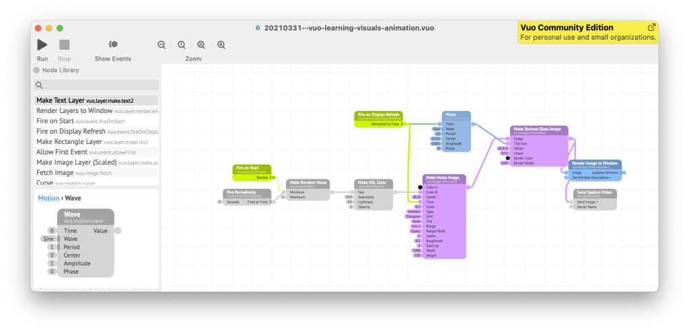
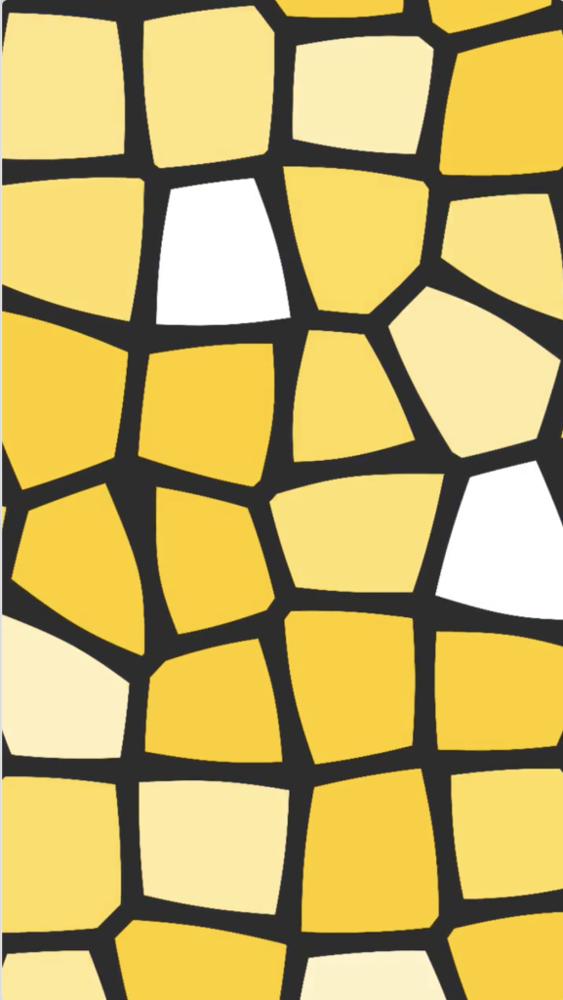
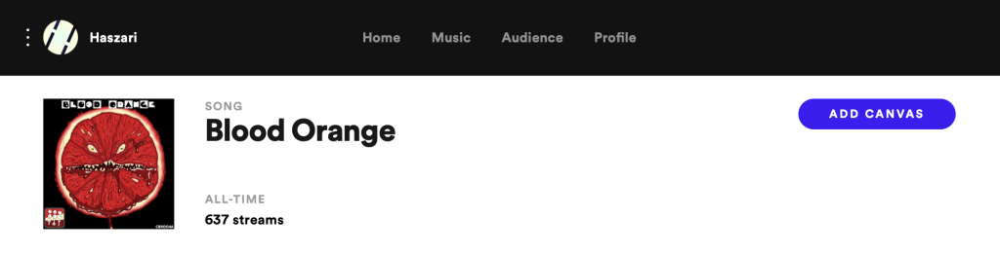

Spotify has a [nifty feature called Canvas that allows you to add a short visual loop to your music](https://canvas.spotify.com/). When someone listens to your song on mobile, they'll see your animated video full screen in the mobile app.

<!-- wp:more -->
<!--more-->
<!-- /wp:more -->

It's a good idea to use things like this in Spotify. Your songs are more interesting and engaging, and who knows, you might get more plays or included on more playlists with a canvas. Maybe you can tell more of a story with audio and video.

This website started as way to release electronic music made by me and my friends. My hobby music label was named *Cartoon Beats Reality*. This is a nod to my love of abstraction (over realism) inspired in part by [Scott McCloud](http://scottmccloud.com)'s [Understanding Comics](https://en.wikipedia.org/wiki/Understanding_Comics). I was inspired by the idea that iconic, abstract representations are intrinsically cute and relatable. For me, this is part of the appeal of music, and electronic music in particular - it's completely abstract.

All that to say: I should use Canvas to add a cartoon element to my music on Spotify!

## Enter Vuo

[Vuo](https://vuo.org) is an open source [dataflow](https://en.wikipedia.org/wiki/Dataflow) system for developing animations. This means you can build dynamic visuals by connecting different nodes together. It's quick to get started, and you don't need to know what you're doing.

I heard about Vuo on [Create Digital Music](https://cdm.link/2020/10/vuo-visual-patcher-gets-glitchier-more-useful/) and wanted to give it a try. I used to [have](http://haszaristwocents.blogspot.com/2010/06/qtzrendang-open-source-quartz-composer.html) [a lo](https://www.youtube.com/watch?v=9xg3ZPOi4hI&amp;t=7s)[t of](https://www.youtube.com/watch?v=stGrP2RJH-8) [fun](https://www.youtube.com/watch?v=nDf2k3TgWng) with macOS [Quartz Composer](https://taoofmac.com/space/apps/quartz_composer) (discontinued), Vuo is an open source tool that works in a similar way.

So my challenge was to build a short video loop with Vuo and upload it to Spotify.

## Make the animation

There's a nice [getting started tutorial](https://vuo.org/start) in the manual for Vuo. You get pixels on screen immediately, and the animation is simple and effective – I was inspired!

Using that as a base, I made a few tweaks to customise it a little.

<!-- wp:columns -->

I changed the colours to match the title of the [song](https://cartoonbeats.com/product/eggs-for-tea/) - yellow yolk. 

Then I tweaked the "stained glass" settings so it [looks like cells](https://cartoonbeats.com/eggs-for-tea/). Thicken walls, adjust the scale so the cells are a good size.

To make it more alive, I animated some aspects: 

- Randomly change the thickness of the walls.
- Slowly zoom the image in and out so it feels like it's pulsating.

<!-- /wp:columns -->

## Export a video file

Canvas [expects](https://docs.google.com/presentation/d/e/2PACX-1vRRYYuzyMNOhrB3amuOt2KmPgLsEV1C6uCiHtqgpNuso_gpW_bgTVwMCXbGFCrIavTt8RUC8bfE9KYA/pub?start=false&amp;loop=false&amp;delayms=3000&amp;slide=id.g4f8e5e4ef6_0_0) a video in vertical 9:16 aspect ratio - for example, 720x1280 pixels. It must be short (less than 8 seconds) and an mp4 file.

The best way to export a video file in Vuo is to use the [Image Generator protocol](https://vuo.org/protocol/VuoImageGenerator) and then Export &gt; Movie. This gives you full control over resolution, aspect ratio and other settings.

A quick way to export a file is to record the render window. I used this technique because I'm experimenting (and it's supported in the free [community edition](https://vuo.org/download)). You can control the animation aspect ratio with the width and height properties of a "make image" generator.

You'll need a Render Image to Window node in your composition. When you play the animation it runs in the Vuo Composition Loader app. Then you can start and stop record with File &gt; Start Recording (or command-option-E).

This should produce a .mov file on the desktop.

### Convert video in Handbrake

I used [Handbrake](https://handbrake.fr) to convert the video to mp4.

The video dimensions weren't exactly correct, so I used Handbrake's Dimensions settings panel to force 720x1280 and subtly bend the aspect ratio to match.

## Upload to Spotify

You'll need to be signed up to [Spotify for Artists](https://artists.spotify.com/). Log in, click through to the Music tab, and click the song you want to add a canvas to.

Click the Add canvas button in the top right, and upload your video.

This will tell you if there are any issues with your video - for example: too long, too short, wrong format.

Once you've uploaded your video, you're good to go! The animated canvas will play for your listeners soon - it may take a little while (mine took a few minutes).

<!-- wp:buttons -->
[Click here to check it out on Spotify!](https://open.spotify.com/track/37K4d3GgiJLDS3eqksd48A?si=vMGwt-zgRniqnZPsLsl7xw)

<!-- /wp:buttons -->

## Next steps

I'm pretty chuffed with how easy this is. Like any great bit of technology, this opens up more possibilities!

- Set the video length to suit the song tempo. For example, set the length to an exact number of beats.
- Similarly, drive animation changes in time with the tempo.
- Use Vuo animations in a live stream. You can send the output of Vuo to OBS using the Send Syphon Video node.
- Add Vuo videos to your songs on YouTube or Vimeo.
- Create engaging Instagram or TikTok ads for your music.