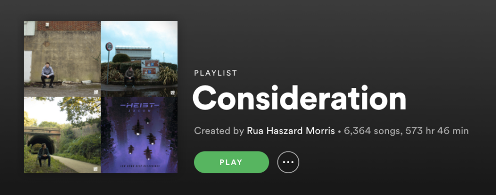
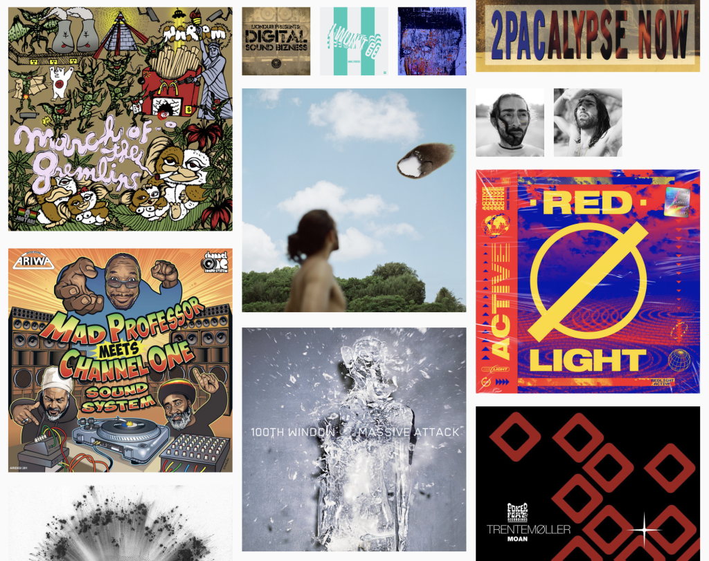

I love discovering new music, even though it can be tiring.

When streaming services have such deep catalogues, everything is within reach. You don't need to track down albums and buy it all - you're free to explore!

Consequently I love Spotify, which even has cool features like [Discover Weekly](https://www.spotify.com/us/discoverweekly/) that are designed to help you find new music.

## Too much music!

Because there's so much to wade through, it can be overwhelming. Every day I come across artists and releases that I want to check out later. I add them all to a [playlist](https://open.spotify.com/playlist/43m3aAgpbJnoanT48x8ZKI?si=dnQCYLoVQDiQZYEsFF-Vuw) in Spotify, but over time this has grown out of control. I'm adding stuff faster than I can listen to it.

The idea was that I'd add artists and albums to this list and then later I'd listen to them (in the weekend? on a road trip? on my [non-existent commute](https://automattic.com/work-with-us/)?). If I hear something great, I'd follow the artist, add the album, add specific tracks to DJ lists.

The problem is that I'd end up listening to this playlist on random. I'd hear stuff go past, but I wasn't intentionally listening to an artist or album.

## Enter the Spotify API

Spotify doesn't solve this "big playlist" problem for me directly. It's not very easy to pick an artist or release to focus on - Spotify shows playlists as a list of tracks (spreadsheets, anyone?), and allows either sequential or shuffle playback. Scrolling and shuffle have limits with this many tracks.

However, Spotify has a wonderful API that allows anyone to build other ways to browse and listen to music. You can access all your collection and playlists, a [wealth of metadata on each track](https://developer.spotify.com/documentation/web-api/reference/#category-tracks) (e.g. tempo, speechiness, or danceability), and control playback.

Using this API, I've started experimenting with different ways to explore my playlists. The first one is a view of album art, so I can scroll through the albums in my huge playlist to find something to listen to.

## No more spreadsheets

Even though this is really basic right now, I find it really useful and fun and I use it regularly.

It reminds me of the awe I used to experience browsing through albums in a record store, picking stuff based on what the cover looks like. I'd been missing this feeling since I've been doing all my listening through playlist-based (spreadsheet style) interfaces in the last 10+ years.

Click the button below try it with your own playlists. Or [hack on the code](https://github.com/haszari/ajugi) if you like.

<!-- wp:buttons -->
[Click here to try it](https://landscape.cartoonbeats.com/ajugi)

<!-- /wp:buttons -->

As I say, it's really basic:

- Authorise the app to access your Spotify account.
- Select a playlist.
- Wait a moment while the playlist is processed.
- Scroll through the albums, EPs and singles in the list, as cover art.
- If you want to listen to one, or want to know who it's by, click the picture to pop up a play button (and artist, title and release date).

How do you discover new music? How do you keep up with new music?

If you could build a new interface for exploring music, how would it work? Let me know in the comments!