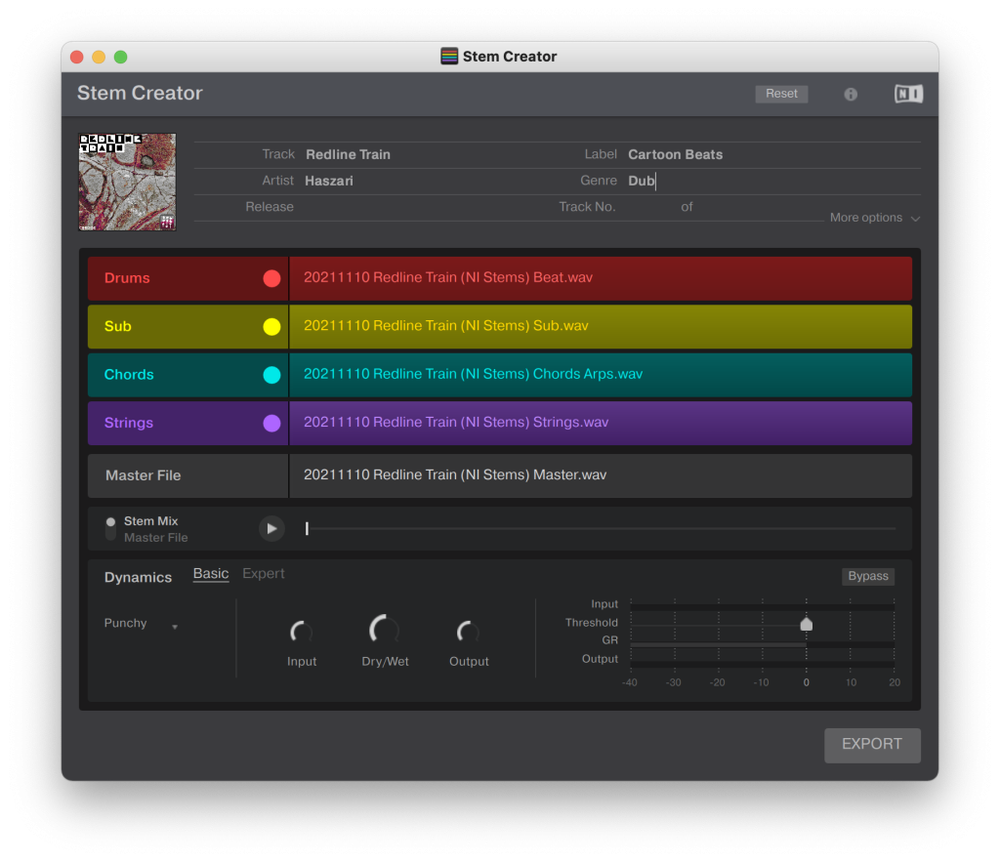

I have a gig coming up! I'm playing a [little festival](https://www.eventbrite.co.nz/e/behind-the-bamboo-summer-festival-tickets-214512852717?aff=erelexpmlt) at **[New New New](https://www.newnewnew.nz)**, with proceeds going to [various mental health and support charities](https://www.eventbrite.co.nz/e/behind-the-bamboo-summer-festival-tickets-214512852717?aff=erelexpmlt).

It's an eclectic line up of folk, indie, punk, blues, dub and of course electronica. So I'm planning on playing a live set of my original music (as opposed to DJing).

Normally an upcoming live set means me locked in my room noodling and editing and adjusting tools … forever. It happened again this time. I spent a lot of weekends and evenings iterating very slowly towards a live set in [Bitwig](https://www.bitwig.com).

This effort is not sustainable. I found I was spending more time writing code and solving routing puzzles, and very little time rehearsing a performance.

## Enter stems format

A few years ago [Native Instruments](https://www.native-instruments.com) promoted a new file format for use with my favourite DJ software - Traktor. **[Stems](https://www.stems-music.com)** allows you to DJ as you normally would – but with your tracks broken down into four stem tracks!

So you can mute and filter the drums, bass, leads of songs as you play them. It's simple, yet much more flexible than DJing with just a regular stereo master. It's a cool idea – it's actually similar to what some punters think DJs do! 😆

Perhaps this is a simpler way for me to perform live, and double down on DJing.

## You can wrangle stems with your DJ setup

When Stems first launched, I didn't get very var. They didn't work unless you had one of a few specific hardware controllers. Also, there wasn't much music available in the format.

Since then, Traktor has expanded support to more controllers, including my slightly old S4 Mk2.

<!-- wp:embed {"url":"https://www.youtube.com/watch?v=sTx6V5X8j-Q","type":"video","providerNameSlug":"youtube","responsive":true,"className":"wp-embed-aspect-16-9 wp-has-aspect-ratio"} -->
<figure class="wp-block-embed is-type-video is-provider-youtube wp-block-embed-youtube wp-embed-aspect-16-9 wp-has-aspect-ratio">https://www.youtube.com/watch?v=sTx6V5X8j-Q

</figure>
<!-- /wp:embed -->

Or you can map parameters like part mute, level and filter with any generic MIDI controller.

<!-- wp:embed {"url":"https://www.youtube.com/watch?v=U4wRzaOefjE","type":"video","providerNameSlug":"youtube","responsive":true,"className":"wp-embed-aspect-16-9 wp-has-aspect-ratio"} -->
<figure class="wp-block-embed is-type-video is-provider-youtube wp-block-embed-youtube wp-embed-aspect-16-9 wp-has-aspect-ratio">https://www.youtube.com/watch?v=U4wRzaOefjE

</figure>
<!-- /wp:embed -->

## You can easily make your own stems

You can make your own stems with a free tool – **[Stems Creator](https://www.stems-music.com/stem-creator-tool/)**.

<!-- wp:embed {"url":"https://www.stems-music.com/stem-creator-tool/","type":"wp-embed","providerNameSlug":"stems"} -->
<figure class="wp-block-embed is-type-wp-embed is-provider-stems wp-block-embed-stems">https://www.stems-music.com/stem-creator-tool/

</figure>
<!-- /wp:embed -->

It's super basic but does what you need. Here's how it works:

- Drag in four uncompressed stem files.
- Drag in a stereo master file.
- Note: make sure all your files are the same length; the output will use the shortest file's duration.
- Edit metadata, e.g. artist, title, cover art.
- Optionally customise the stem part names.
- Optionally tweak dynamics (compressor) settings applied to the stems.

Then click export and it will generate a stem.mp4 file 🎉

I've taken a similar approach "4-stem" approach in the past – e.g. for *[Padded Landscape](https://cartoonbeats.com/padded-landscape/)*, where each song is broken down into four parts that are randomised.

So it's nice to be building on a previous practice.

## How does this change my life?

Using stems makes my life easier and my performance more dynamic.

I can spend my evenings and weekends making cool music in any music software. When I want to play it out it's a 15-minute job to make a stems format version using Stem Creator.

This means I have a wider range of music to play, and I can experiment more with production, synthesis and mixing techniques.

Although the sky is the limit when playing live with Ableton or Bitwig, this is dangerous if you are time or talent limited. I spent a lot of energy trying to build synthesis instruments in software that would work well across multiple songs.

I also spent a lot of time trying to wrangle fills, transitions and complex arrangements in Bitwig (and Ableton). I never found a good flexible way to rearrange a song live. With Stems I can have a complete and complex arrangement if I want, and still cut the song up into smaller loops for more flexibility.

Routing and effects are also much more predictable and usable in Traktor. I love Traktor's effects and find them really inspiring to jam with. That's also true of Bitwig's effects and synthesis. However, with a DAW I don't have a control surface pre-mapped with effects sends, EQ and filter, and feedback (lights). You can build something but it takes time.

Another advantage is tempo control. Although most DAWs can now sync samples and loops to a tempo, you still need to map a way to perform tempo changes, and possibly do it smoothly (e.g. in an ambient transition). With Traktor you can change tempo smoothly or abruptly and all the decks and effects will follow along.

I am not a huge fan of waveforms, but with Stems they are really powerful. You can see how your track is structured across the four parts. In a DAW it's harder to keep track of what's in a clip, e.g. if it's sparse or dense.

Ultimately I'm reducing the space of things I need to develop and build for my performance – to four audio stems per song. I'm spending my time making audio, instead of making systems for playing live.

## FAQ

### How do stems work with Kontrol S4?

- Remix slot buttons are mute/unmute.
- Shift-slot to select, and then loop encoders are level and filter.
- Note: make sure Hotcue Buttons option is set to Remix Mode in settings.

### Can I control stems with generic MIDI?

Yes!

- There are mappable commands for stem level, FX etc.
- Map these to your hardware in Controller Manager:Deck Common &gt; Submix &gt; Slot…

### How do effects work?

- Same as a normal deck – the affects are patched in with FX send 1/2 buttons.
- However, you have more control! There's a FX amount param per stem. This works as you'd expect for send-style effects (e.g. delay) or insert (e.g. filter).
- So for example, you can set your stem up so the bass and drums don't go to your delay effect.