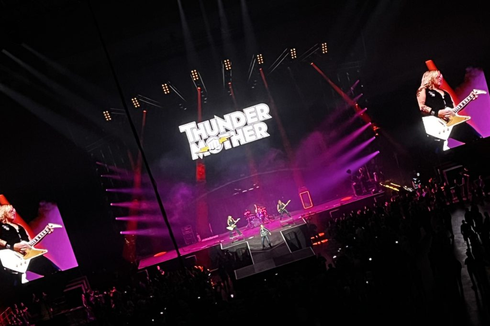

I'm in Sweden and looking for things to go to – concerts, events, art galleries. Legendary 80s German rock band **[Scorpions](https://www.the-scorpions.com/)** are playing in the [spherical Avicii Arena](https://aviciiarena.se/) – this could be good!

I only know *[Wind of Change](https://www.youtube.com/watch?v=n4RjJKxsamQ)*, but it's such an iconic song I'm happy to go along just to see that live. Off to Spotify to hastily compile a list of hits based on [probable set list](https://www.setlist.fm/setlists/scorpions-3d63ddf.html), and also check out **[Thundermother](https://www.thundermother.com/)**, the all-female 70s rock support act.

First up, **Thundermother** are great. This show – and this crowd of Sweden bogans of advanced age – is all about nostalgia. **Thundermother** are a textbook slice of 70s punk attitude, even playing a snippet of **Joan Jett**'s *[Bad Reputation](https://www.youtube.com/watch?v=nO6YL09T8Fw)* as they leave the stage.

Other than sounding exactly like pure rock &amp; roll, I didn't recognise anything from the **Scorpions** greatest hits … until *Bad Boys Running Wild* came on! I recognise this riff – sampled by **Armand Van Helden**'s *[Little Black Spiders](https://www.youtube.com/watch?v=B_MBXcb73VQ)*. Back from the days when dance music was more eclectic, and lots of big-room tunes sampled rock or 70s vibes. **Listen to this playlist to follow the thread:**

<!-- wp:embed {"url":"https://open.spotify.com/playlist/3XOFzZoead2QIkAp60ruGw?si=044ae059ebc24555","type":"rich","providerNameSlug":"spotify","responsive":true,"className":"wp-embed-aspect-21-9 wp-has-aspect-ratio"} -->
<figure class="wp-block-embed is-type-rich is-provider-spotify wp-block-embed-spotify wp-embed-aspect-21-9 wp-has-aspect-ratio">https://open.spotify.com/playlist/3XOFzZoead2QIkAp60ruGw?si=044ae059ebc24555

</figure>
<!-- /wp:embed -->

This sound inspired me a lot too over the years. It reminds me of how obsessed I was with the sound of classic rock reproduced via electronic means. Leather-jacketed **Justice** are masters of this sound. Their "cross" album and the *Mulholland Drive* distortion effect in Traktor inspired my *Blood Orange*.

Back to the gig. **Scorpions** rocked, despite their advancing years! This was a no-frills rock show dynamically bouncing between rockin' vocal songs, epic instrumental jams, and of course power ballads.

The visual element and light show complemented the band well, with some epic cheese.

<!-- wp:jetpack/tiled-gallery {"columnWidths":[["45.82620","54.17380"],["18.93552","19.36611","29.29492","32.40345"]],"ids":[1839,1836,1835,1840,1834,1838]} -->

<!-- /wp:jetpack/tiled-gallery -->

Doves smashing through the Berlin wall, a "Rock Believer Jackpot" fruit machine at the climax of the drum solo, four flame-enhanced 3D animated V8 ish engines. I couldn't help videoing it – guilty!

<!-- wp:video {"id":1845} -->
<figure class="wp-block-video"><video controls="" src="https://haszari.cartoonbeats.com/wp-content/uploads/2023/06/drumsolo.mp4"></video><figcaption class="wp-element-caption">DRUM SOLO! 🙌🥁</figcaption></figure>
<!-- /wp:video -->
<!-- wp:video {"id":1843} -->
<figure class="wp-block-video"><video controls="" src="https://haszari.cartoonbeats.com/wp-content/uploads/2023/06/badboys.mp4"></video><figcaption class="wp-element-caption">Bad Boys Running Wild 🕷️</figcaption></figure>
<!-- /wp:video -->
<!-- wp:video {"id":1848} -->
<figure class="wp-block-video"><video controls="" src="https://haszari.cartoonbeats.com/wp-content/uploads/2023/06/v8.mp4"></video><figcaption class="wp-element-caption">Very metal – not sure what song this is but there's a scorpion, flames, "engine gasket" frames, and animated engines ⚙️🔥</figcaption></figure>
<!-- /wp:video -->
<!-- wp:video {"id":1841} -->
<figure class="wp-block-video"><video controls="" src="https://haszari.cartoonbeats.com/wp-content/uploads/2023/06/windofchange.mp4"></video><figcaption class="wp-element-caption">Wind of Change 🕊️🧱</figcaption></figure>
<!-- /wp:video -->

They even changed the lyrics to show support for Ukraine.