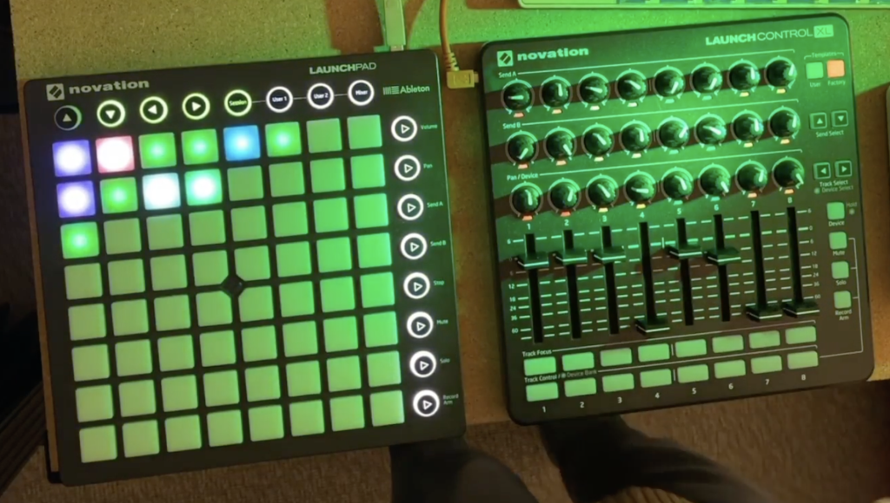

Since getting home from my sabbatical, I've been working on my live set a lot. I feel like I have all the technical pieces I need – to play the live set I've always dreamed of.

[At Catalyst,](https://cartoonbeats.com/live-set-tactics-bitwig/) I was travelling, and was "improvising" with a couple of small portable controllers that I brought on the trip.

- A Traktor Kontrol F1 – 4x channels, each with a fader and a knob (and a few buttons).
- A Korg nanoKontrol (the original version!) – 9x channels, each with a fader, a knob, and 2 buttons.

Since getting home, I switched over to a Novation combo: a [LaunchPad Mk2](https://downloads.novationmusic.com/novation/launchpad-mk2) and a [LaunchControl XL](https://novationmusic.com/products/launch-control-xl). These are actually very portable too. But much more powerful!

I use the LaunchPad as a clip launcher, as Lord Ableton intended, with the [hugely complex and powerful DrivenByMoss Bitwig extension](https://github.com/git-moss/DrivenByMoss).

## My secret sauce

The LaunchControl is more custom, and is my secret live-set sauce.

The classic use case for this kind of controller is to emulate the many low-value controls on a classic, uninspired, hardware mixing desk:

- Fader
- Pan
- Aux send A level
- Aux send B level
- Record enable
- Mute or solo

This setup is easy for pro musicians to understand, but supremely dull from a live performance point of view.

To perform live I want to tweak filters, synth params, envelope params. So what I've always wanted is a controller with lots of knobs, and the ability to map those knobs to fun synth params, or macro controls that affect multiple sonic parameters.

[Bitwig 5.0 is designed with exactly this in mind](https://cdm.link/2023/04/bitwig-studio-5/)! [Each channel has a dedicated performance parameters section, and these can be shown on the mixer panel](https://www.bitwig.com/whats-new/). Exactly the kind of knobs you want to fiddle live – and I'm happy to swap out things like pan for these macro controls!

So I built [a very basic custom extension to auto-map each channel's first three macro params to the LaunchControl knobs](https://github.com/haszari/wide-bitwig-controller-extensions/tree/main/NovationLaunchControlXL).

## What does it do?

This is really flexible. I can map those macro controls to anything I want, using [Bitwig's ridiculously expansive and flexible modulation system](https://www.bitwig.com/learnings/an-introduction-to-modulators-45/).

So instead of pans and sends, I have filter cutoff, envelope decay, etc – whatever's best for that instrument on that channel. (I could of course map it to pan if I want.)

I still like sends, so I've used the channel buttons as a momentary send "stab" – when held, the channel is routed 100% to that send.

## Let's hear it then!

Since getting home, I've also been sketching out a lot more minimal beats – trying to reduce to the minimum, but layering up enough elements to get some funk and bounce.

[Here's a jam I recorded with four recent unreleased tunes](https://soundcloud.com/haszari/handshake-pentagrill-jomaigy-displacement-live-jam-20231003), blending elements into a minimal twenty-minute techno groove.

I'm trying strike a balance between sonic interest and keeping a consistent, minimal groove. I've struggled with this in the past. It's hard to focus on space and simplicity, and focus on what would work in a huge warehouse with a massive system … when you are in a little room, by yourself. I'm always tempted to add more, and move faster.

<!-- wp:embed {"url":"https://soundcloud.com/haszari/handshake-pentagrill-jomaigy-displacement-live-jam-20231003","type":"rich","providerNameSlug":"soundcloud","responsive":true} -->
<figure class="wp-block-embed is-type-rich is-provider-soundcloud wp-block-embed-soundcloud">https://soundcloud.com/haszari/handshake-pentagrill-jomaigy-displacement-live-jam-20231003

</figure>
<!-- /wp:embed -->

If you like the sound of that, keep an eye on [my YouTube](https://www.youtube.com/haszaritube) for [more live jams](https://www.youtube.com/watch?v=_53npU_jK98).

<!-- wp:embed {"url":"https://www.youtube.com/watch?v=_53npU_jK98","type":"video","providerNameSlug":"youtube","responsive":true,"className":"wp-embed-aspect-16-9 wp-has-aspect-ratio"} -->
<figure class="wp-block-embed is-type-video is-provider-youtube wp-block-embed-youtube wp-embed-aspect-16-9 wp-has-aspect-ratio">https://www.youtube.com/watch?v=_53npU_jK98

</figure>
<!-- /wp:embed -->