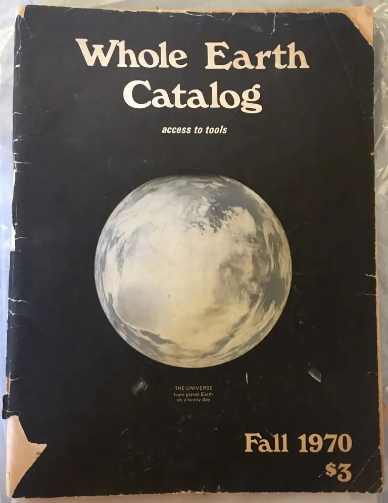

I just launched this site and I wanted to use custom fonts. A relatively simple way to make a generic theme &amp; layout my own.

In recent versions of [Gutenberg](https://wordpress.org/plugins/gutenberg/) (a plugin packaging forthcoming WordPress features), [there is a Font Library](https://make.wordpress.org/test/2023/10/03/help-test-the-font-library/). You can upload custom fonts or use [Google Fonts](https://fonts.google.com/).

All I had to do was:

- Install &amp; activate Gutenberg plugin.
- Upload my chosen fonts.
- Select my fonts for headings, body text, buttons etc.

## About my chosen type

<!-- wp:columns -->
I have modelled my type loosely on the [Whole Earth Catalog](https://en.wikipedia.org/wiki/Whole_Earth_Catalog), a series of tomes intended to provide all of humanity access to the best tools. Proto-open-source; [google before Google](https://www.latimes.com/opinion/op-ed/la-oe-markoff-stewart-brand-whole-earth-catalog-20180328-story.html). 

*Do we need a new google after Google…?*

<!-- /wp:columns -->

A selection of these catalogs loomed large in my childhood on our living room bookshelf.

I wanted that signature look of a large, serif font and a small, lowercase sans font – nostaglic and utilitarian. I'm not using the exact same fonts as the printed catalog; they are $ expensive.

Google Fonts has Hedvig Serif and Hedvig Sans which work perfectly for my needs.