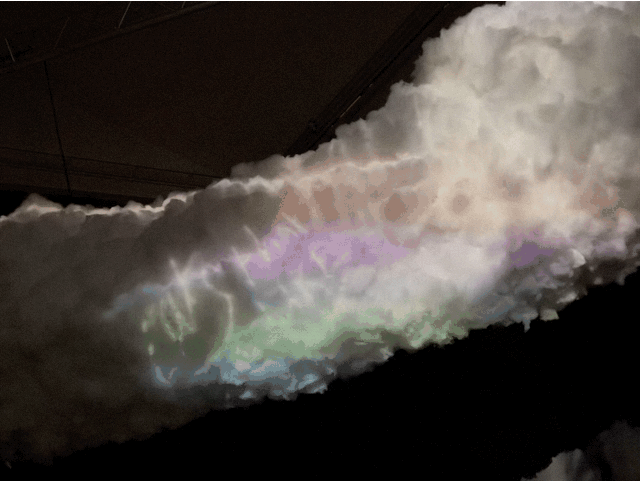

In Stockholm I visited the local contemporary art gallery:  [Moderna Museet](https://www.modernamuseet.se/). Lucky for me the feature exhibition was [a Laurie Anderson retrospective](https://www.modernamuseet.se/stockholm/en/exhibitions/laurie-anderson/).

The first room celebrated a tiny ["origin story" of Anderson's grandad](https://www.apollo-magazine.com/laurie-anderson-interview-circa-moderna-museet/) with a series of … photographs. He moved (from Sweden to USA) at age eight, started a business at nine and married at 10.

My introduction to Laurie Anderson was the album [Strange Angels](https://open.spotify.com/album/6Sy383KpqoNe5b6MmvgfCQ?si=OxBCKzzER1mzRfOF24mR2Q), played often by my mother in my childhood. It's only more recently that I realised Anderson is an electronic music pioneer and multidisciplinary artist.

I was fascinated by how she told a tiny little story with each piece or project. This work is simple and relatable – anyone can chuckle or engage with it – but also profound. Observational in an observational comic, Jerry Seinfeld kind of way.

<!-- wp:spacer {"height":"1em"} -->

<!-- /wp:spacer -->
<!-- wp:jetpack/tiled-gallery {"columnWidths":[["66.76825","33.23175"]],"ids":[1890,1892,1891]} -->

<!-- /wp:jetpack/tiled-gallery -->

Her photographic series from the 70s are a fun example.

<!-- wp:columns -->
I decided to take pictures of men who made comments as I passed them on the street.
Laurie Anderson, Fully Automated Nikon, 1973

Public sleeping is discouraged, if not illegal
Laurie Anderson, Institutional Dream Series, 1972-1973

<!-- /wp:columns -->
<!-- wp:spacer {"height":"1em"} -->

<!-- /wp:spacer -->
<!-- wp:jetpack/tiled-gallery {"columnWidths":[["66.72218","33.27782"]],"ids":[1894,1895,1896]} -->

<!-- /wp:jetpack/tiled-gallery -->

There was also virtual reality (*To the Moon*). I can't wait to see what artists do with the [Apple Vision Pro](https://www.apple.com/apple-vision-pro/).

