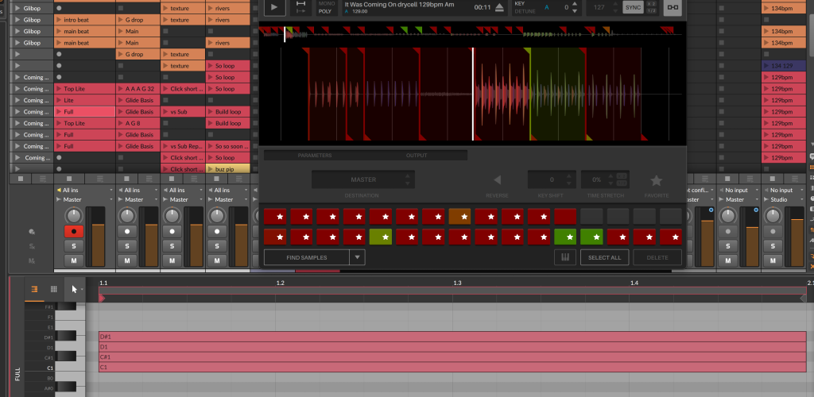

This post is all about how my live set works. Every time I do a live set, I throw out everything I've done before, pick a new platform, and build it all again. Even with the same songs.

This isn't what I intend to do, it's just what ends up happening.

<!-- wp:embed {"url":"https://soundcloud.com/haszari/catalyst-summer-live-set","type":"rich","providerNameSlug":"soundcloud","responsive":true} -->
<figure class="wp-block-embed is-type-rich is-provider-soundcloud wp-block-embed-soundcloud">https://soundcloud.com/haszari/catalyst-summer-live-set

<figcaption class="wp-element-caption">*Listen to the set while you read about it…*</figcaption></figure>
<!-- /wp:embed -->

Now I'm using [Bitwig](https://www.bitwig.com/) I have a more sustainable, reusable setup for live. Exciting times!

I played live twice at [Catalyst](https://catalyst-berlin.com/) during my [four-week summer course](https://catalyst-berlin.com/about/summer-course-programme), in week 3 and 4. This set used material brand-new recorded &amp; written at Catalyst (my [1-minute sketches](https://soundcloud.com/haszari/sets/mini) from week 1 &amp; 2), and also some of my unreleased music.

I take it as a massive win that I was able to program and prepare this set while doing the course. Other live sets have completely taken over 100% of my downtime for months / years.

## Track per instrument – Bitwig Instrument Layer

One of the main principles for how I want to play live is that I want to have a small number of channels that map roughly to instruments – drums, bass, chords, lead. And I also want each song to sound different (not use the same instruments).

Bitwig has containers (similar to Ableton Live's Instrument Racks) that allow me to stack multiple instruments and synths in a channel. Each instrument only plays notes from a specific MIDI channel.

Each instrument can have separate effects, synthesis, and processing so each song sounds unique.

<!-- wp:gallery {"columns":1,"imageCrop":false,"linkTo":"none"} -->

<!-- /wp:gallery -->

## Stem samplers – Serato Sample

I don't produce all my music in Bitwig – I also use [Logic Pro](https://www.apple.com/logic-pro/), and make and record audio in many places. So I can either recreate or simulate the synthesis  I do elsewhere – extremely time consuming – or use sampled loops.

To keep my samples alive I prepare special stems of all the music I work on. I render a single stereo file with all the drum loops, drum hits, bass and synth lines – everything, separated out with silence between and at a known BPM. All long-tail effects such as reverb and delay are removed, so this "drycell" can be sliced up to make new arrangements of the material quickly.

I use [Serato Sample](https://serato.com/sample) for playing back these samples. It's really simple but also really powerful. The workflow goes like this:

- Import the sample file.
- Ensure the tempo is correct.
- Enable quantisation (snap to beat) for markers.
- Enable POLY mode so I can play multiple samples concurrently.
- Add markers for each loop or sample that I want to use live and assign each to a note/pad.

Serato has multiple output channels so you can add effects and could even potentially play your whole song from a single sampler. This is the approach I take but I have a separate copy for each instrument vertical (drums, bass etc). I add back delays and reverbs to roughly match what's in the original non-live version of each song; but now the effects are live, and the loops can be edited/triggered however I want.

It would be FANTASTICALLY AMAZING if Bitwig made a native sampler that worked like this (or Ableton).

This means I can play back parts of my songs with MIDI note clips, at any tempo. It's a really fast way to experiment with arrangement, or combinations of lines.

For example, the *It Was Coming On* drums are in multiple layers, so I can have clips with different combinations of kicks, hats, beats. It's very similar to working with regular audio loop clips (Ableton style) but I can fit a lot more different sound into a single channel, and easily experiment with different combinations.

## Control – what am I doing?

I'm keeping the control really simple. I usually attempt to simplify and fail, but right now I'm on holiday and have limited time and controllers to work with! Win! The two controllers I'm using are Traktor Kontrol F1 and Korg nanoKontrol.

### Triggering scenes

I can't trigger individual clips; only horizontal scenes (rows). I trigger scenes with SYNC button on the F1, and navigate scenes up / down with two other buttons.

The arrangement is somewhat preset by the scenes I have available. In future I could make this more flexible by setting up grid-buttons for triggering individual clips.

Each scene has a clip in the master to set the tempo and time signature. Resetting tempo and time signature like this is more foolproof, and I can start from anywhere. Almost everything I do is 4/4, but because this is an advanced sound design course, one of my pieces is in 9/8 (*[Nontemplate](https://soundcloud.com/haszari/nontemplate-bitwig?in=haszari/sets/mini)*). It's really satisfying that Bitwig can handle this so easily.

Transitions between songs are planned – this is something I want to make more fluid. The transition scene has clips from the outgoing and incoming song (e.g. minimal beeps, texture, stabs). And in the master there is a clip to smoothly ramp the tempo.

### Faders &amp; filters

On the F1, I have one knob and one fader per instrument channel. The fader is just used as a volume fader, for bringing things in and out.

<!-- wp:columns -->

The knob is a macro param that can be mapped to anything on each instrument. This means each song's performance controls can be different. 

And because these are Bitwig remote controls, one knob can control multiple params in different places. E.g. crossfade between two textures, and add filter / distortion in the top half of the knob range.

<!-- /wp:columns -->

### Sends

I also have global reverb and delay sends. This is the main thing I perform with – feedback delay loops and big loud reverb washes.

These are set up on the nano for each channel: a momentary button to send to reverb, and a knob to send to delay.

The reverb has no live params. The delay has feedback, time, and filter. The delay time is synched, but with a very long lag. So if I change delay time, it drifts slowly to the new time.

## Bonus: techno generator

I read a [Resident Advisor article](https://ra.co/features/3526) where **Surgeon** said "this thing has a sample and hold, it's like instant techno" and I realised … 🤓 that's how that works.

The previous night I went to [Berlin Modular Society](https://berlinmodularsociety.com/event-archive) and the whole time was thinking "THEY ARE ACTUALLY MAKING REAL TECHNO ON THESE MODULARS! How?". A random, fast, short melody is a big part of how.

So I decided to test my Bitwig Grid skills by building this myself.

This was definitely a puzzle, but I got there and managed to get this working without losing sleep or getting too distracted from the course. It samples white noise on a trigger and uses that as a midi note value, played as 4 32nd notes (and repeated). There are two copies so when I trigger it to get a new melody it can seamlessly switch to the backup one.

I have a fader, filter, and 4x envelope params (amp attack / decay, filter attack / decay) set up for this and it's really fun to jam on. I think I'll make more of these for more jamming.

I almost forgot to use it in the set until the very end. A bit of a cherry on the top.

## You've been a great audience

Honestly the best part about this set was playing it to a room of appreciative people who are interested and curious! And the folks in the kitchen too.

**Comment if you have any questions!**

Want more? Listen to this Spotify playlist of my best tunes &amp; remixes, and smash that Follow button!

<!-- wp:embed {"url":"https://open.spotify.com/playlist/0hGwn4tIEtJXtzLF9Uihy5?si=b9578eac6af7486f","type":"rich","providerNameSlug":"spotify","responsive":true,"className":"wp-embed-aspect-21-9 wp-has-aspect-ratio"} -->
<figure class="wp-block-embed is-type-rich is-provider-spotify wp-block-embed-spotify wp-embed-aspect-21-9 wp-has-aspect-ratio">https://open.spotify.com/playlist/0hGwn4tIEtJXtzLF9Uihy5?si=b9578eac6af7486f

</figure>
<!-- /wp:embed -->