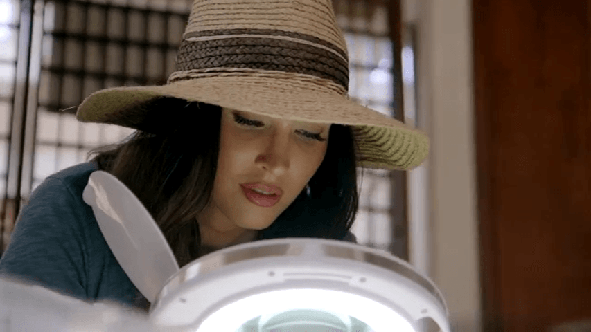

I was not previously a big fan of **Megan Fox** (of Transformers fame). I am now, thanks to *[Legends of the Lost with Megan Fox](https://www.imdb.com/title/tt8362844/)* ([on ThreeNow in NZ](https://www.threenow.co.nz/shows/legends-of-the-lost-with-megan-fox/1698093249063)).

The first two episodes: Stonehenge, then the Vikings. She met up with legendary *non-*"mainstream archaeologist" **[Graham Hancock](https://en.wikipedia.org/wiki/Graham_Hancock)** early on.

In my book, anyone who furthers the "Sunday morning archaeology/mythology soft doco" cause is great.

She's no **[Bettany Hughes](https://www.bettanyhughes.co.uk/)**, but I'm learning a lot from this show.