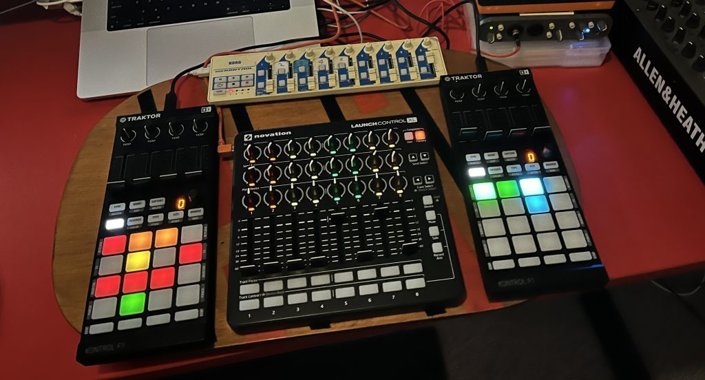
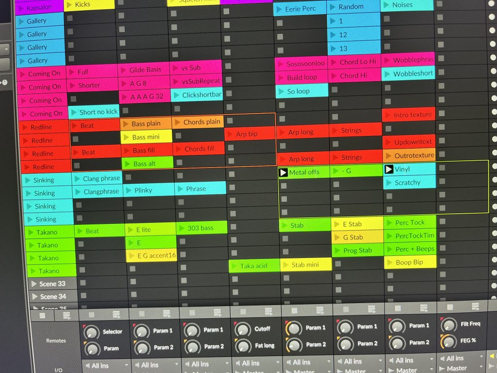

One of the best things about DJing is combining elements from different songs. Working with DJ decks, you can only do so in a limited way – e.g.  blend an intro and an outro, or layer a riff or acapella on top of another song.

When I play live I want to combine elements from different songs. And I don't want to plan ahead – I want access to explore and layer elements freely.

<!-- wp:columns -->
*While you're reading, listen to the tunes ⇒*

<!-- /wp:columns -->

Clip-launcher tools like Ableton Live and Bitwig are designed to allow you to do this. Though typically they are used in a more limited way. Clips are laid out in a grid, and you can scroll around to trigger elements, but only within a certain window.

My [Kontrol F1s](https://www.native-instruments.com/en/products/traktor/dj-controllers/traktor-kontrol-f1/) have 4x4 clip launcher pads, which made me wonder – can I scroll these around independently? Then I could more freely combine elements from anywhere in my set list.

The answer is yes! I've built a [Bitwig extension](https://github.com/haszari/wide-bitwig-controller-extensions) which does this.  The 4x4 grid can be scrolled up and down (and left &amp; right).

In the pictures above, I'm poised to drop beats &amp; bass &amp; chords from *[Redline Train](https://open.spotify.com/track/7KpvYHGUD2pC0p53sNTfA2?si=4289c711bf1948d4)* under spooky ambience from *[Sinking Galley](https://soundcloud.com/haszari/galley-sinking)* (coming soon – release in May).

Each pad lights up with the colour of the clip. I use a combination of colours for each song, so I know where I am, for example:

- It Was Coming On – psychedelic pink &amp; blue
- Sinking Galley – undersea aquamarine &amp; algae
- Redline Train – reggae red, green &amp; yellow

Channels (instruments) run vertically, so I can select from 4 clips for each instrument at any given moment.

I have a rough convention for instruments == channels. This is the toughest thing to get right. A convention is super helpful when playing live, but super limiting if I end up leaning into it too much.

<!-- wp:columns -->
#### Left deck / 4 channels

1. Drums
2. Bass/Sub
3. Chords/Synth
4. Synth/Beeps

#### Right deck / 4 channels

1. Lead/Voc/Perc
2. Lead/Synth/Pad
3. Texture/Perc/Pad
4. Synth/Beeps

<!-- /wp:columns -->

I can only play a single clip in each channel. So if I wanted to combine drums, I'd need 2x drums channels. Right now I'm leaning into smaller elements across more channels – each song can have up to 8 elements or layers.

How can I get different sounds / synths for each song into each channel? I'll explain that in another post!