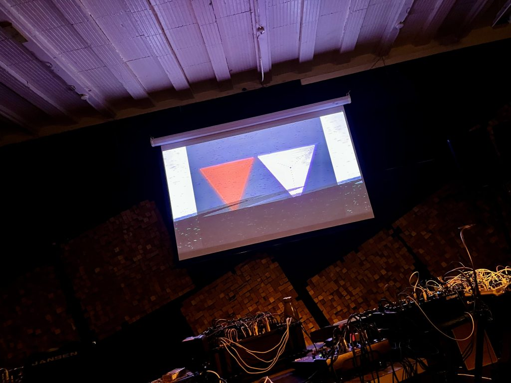
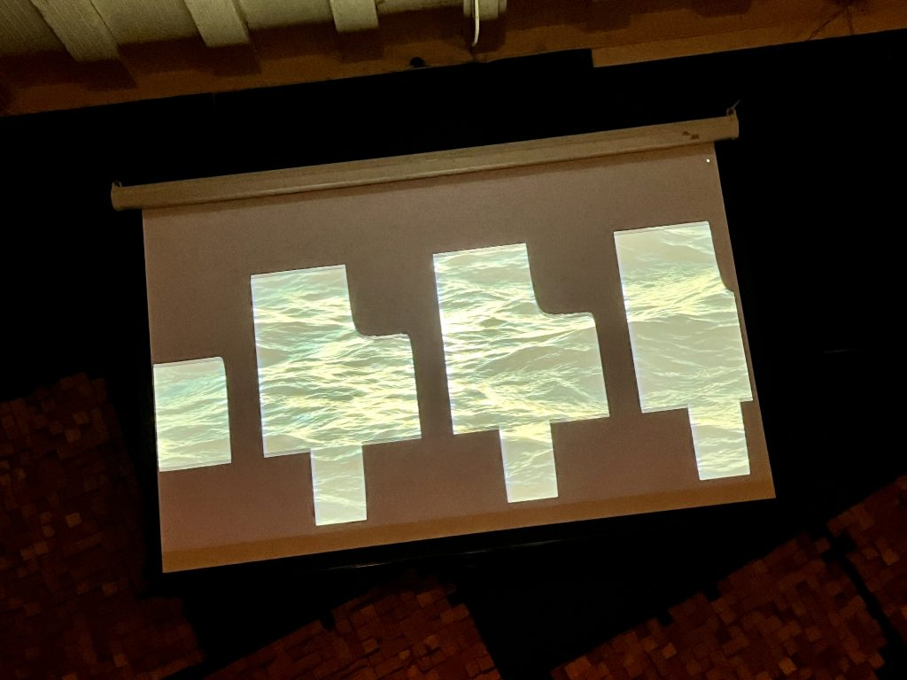
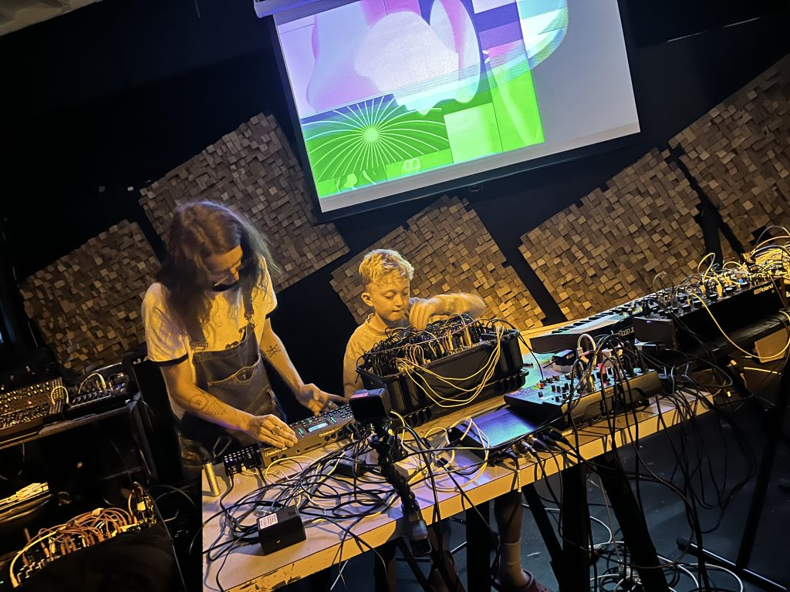
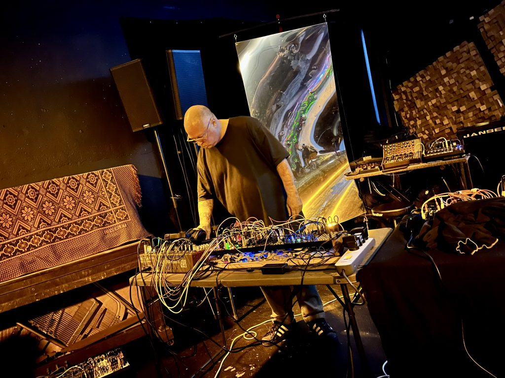
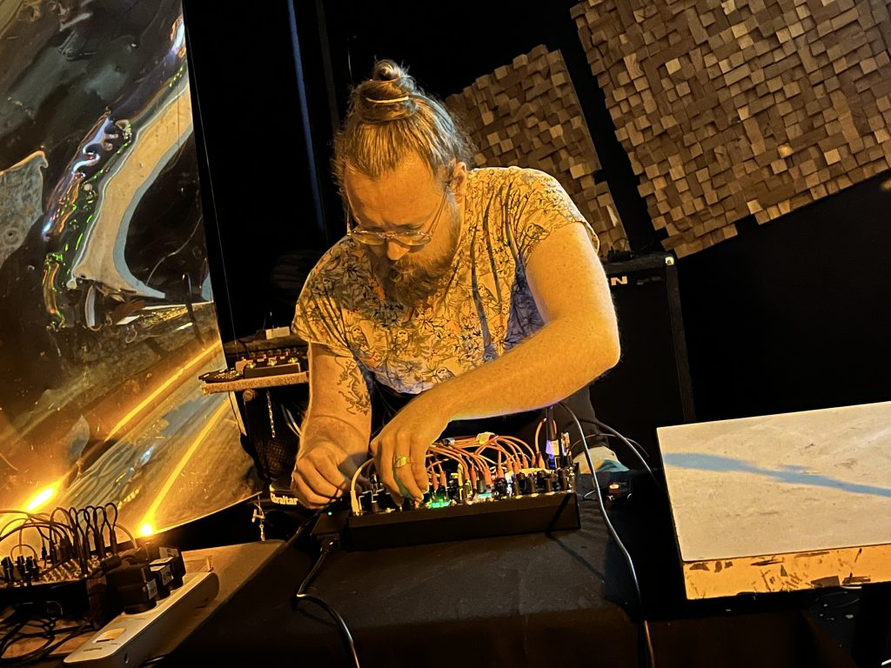
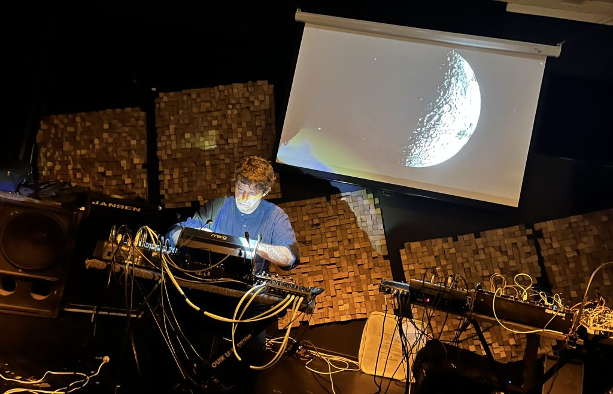
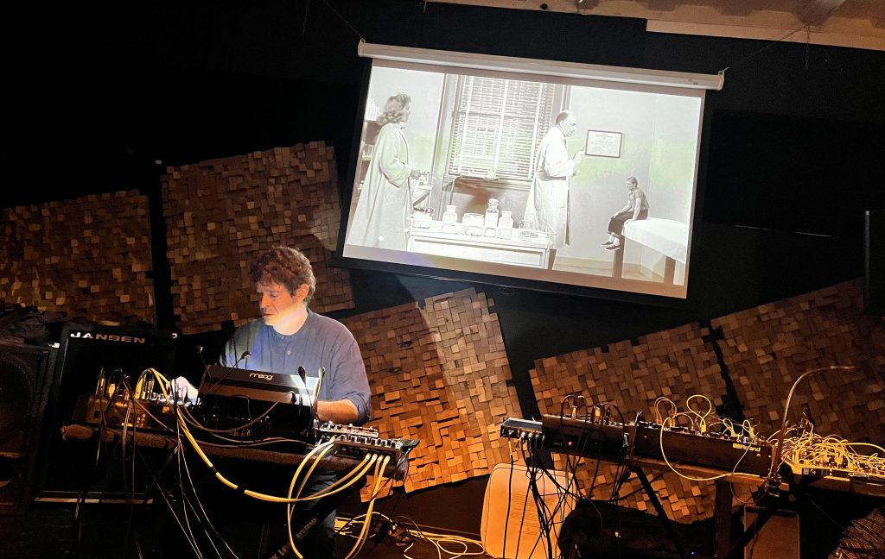
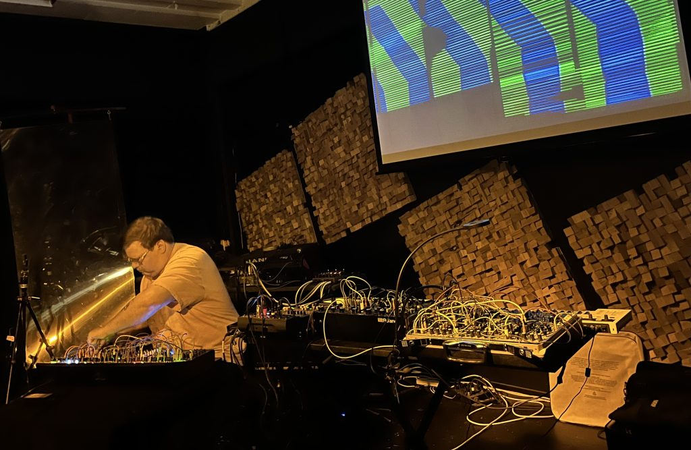
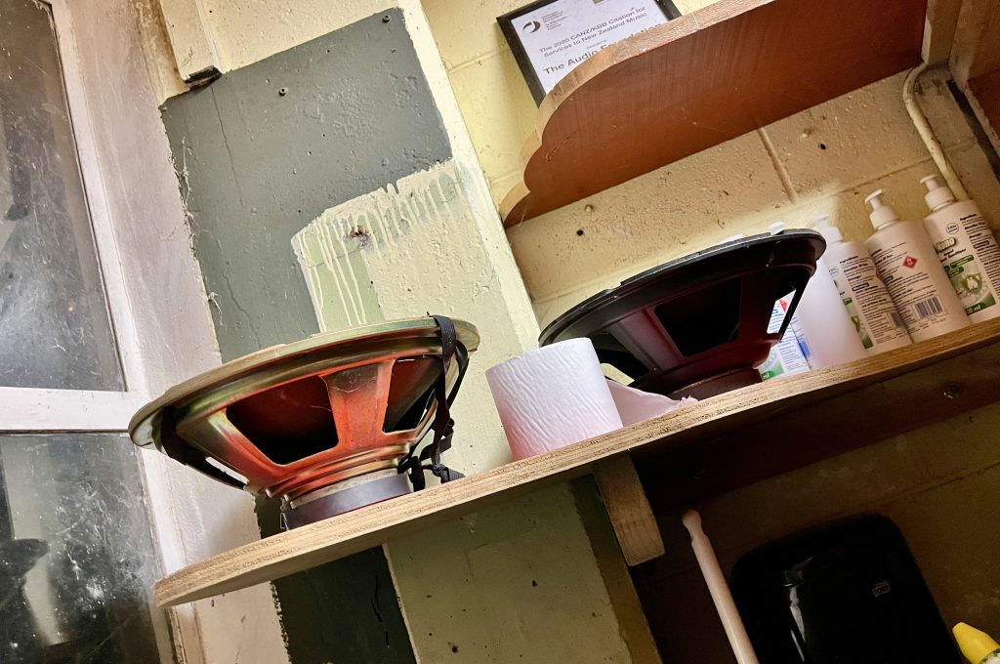

Now I'm in Auckland I finally get to go to [AudioFoundation](https://www.audiofoundation.org.nz/about)! I've been following this place with interest from afar.

<!-- wp:columns {"align":"full"} -->

They put on interesting [events, workshops, sounds](https://www.audiofoundation.org.nz/programmes), publish [Soundbleed](https://www.soundbleed.org.nz/) journal, and generally push the frontiers. Also they have supported some of my music on [AFM](https://afm.org.nz/) 🍻

Modfest, now in its fifth year, is a collective of modular synth nerds, with an afternoon workshop and an evening performance.

<!-- /wp:columns -->
<!-- wp:columns {"align":"full"} -->

**[Modern Chair](https://m0dernchair.bandcamp.com/)** kicked off the night perfectly. 

They played a dense, heavy drone set. At times it sounded like distorted, feeding back guitar amps, but it was constantly evolving and kept your ears engaged, and surprised.

I love that his kid (?) is part of the act, wielding the modular. 

[Octagram Sessions by Modern Chair](https://m0dernchair.bandcamp.com/album/octagram-sessions)

<!-- /wp:columns -->
<!-- wp:columns {"align":"full"} -->
**[aBraille](https://soundcloud.com/abraille)** was up next. His setup had a few levels to it. 

l liked his "observational" performance style – start something up, stand back, listen, then intervene with a cable or knob-tweak.

https://www.youtube.com/watch?v=uBT6-lwqjkc

<!-- /wp:columns -->
<!-- wp:columns {"align":"full"} -->

**[Shalom BK](https://linktr.ee/shalombk)** had a more minimalist setup.

His set was built around field recordings of Gisborne ocean, fed and manipulated to an organic amorphous soundscape.

In the centre of the piece, a poem / spoken word part was really effective.

[drones of gallipoli by SHALOM BK](https://shalombk.bandcamp.com/track/drones-of-gallipoli)

<!-- /wp:columns -->
<!-- wp:columns {"align":"wide"} -->
**[Peter Hobbs](https://peter-hobbs.bandcamp.com/)** played a beautiful, dubby, mesmerising set with special guest **Misako** improvising dance. 

Really inspiring to see two performers bouncing off each other and collaborating live. This was a highlight for me.

UPDATE: here's an excerpt from the performance, now up on [Hobbs' YouTube](https://www.youtube.com/@Peter-Hobbs):

https://www.youtube.com/watch?v=yuxM5ZKMwrg

Side note – **Mind and Body is exactly 4:20 long**, as is my [dubby tune Redline Train](https://open.spotify.com/track/4e0R7nJKDrWhXkxBoE5Yd1?si=57fbb41726a74b4b). Sometimes things are neat like that.

<!-- /wp:columns -->
<!-- wp:jetpack/tiled-gallery {"align":"wide","columnWidths":[["35.94063","17.20353","46.85585"]],"ids":[3112,3111,3113]} -->

<!-- /wp:jetpack/tiled-gallery -->
<!-- wp:columns {"align":"full"} -->

**[Gotal Bournier](https://gotalbournier.bandcamp.com/)** was another standout. 

The sounds were very retro, squelchy, and perfectly suited to the retro cinema visual track. 

[Marooned EP by Gotal Bournier](https://gotalbournier.bandcamp.com/album/marooned-ep)

<!-- /wp:columns -->
<!-- wp:columns {"align":"full"} -->
**Modal Komodo** closed the night perfectly. His blissful ambient melodic set echoed the supportive vibe in the room. 

https://www.youtube.com/watch?v=XxPYyRpGCtE

<!-- /wp:columns -->

---

I wish I'd taken some photos of the stairwell. This is a sub-basement venue, so there are a lot of stairs, and they are beautifully industrial with primary colour murals on the concrete blocks.

I didn't get the names of the visuals performers ~~– if you know, send me details~~. **UPDATE** – visuals were by **Vero Manchego** and **Roy Blackmore**.

There are speaker cones in the toilets.

