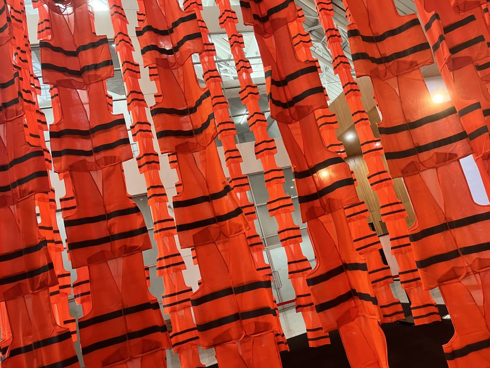
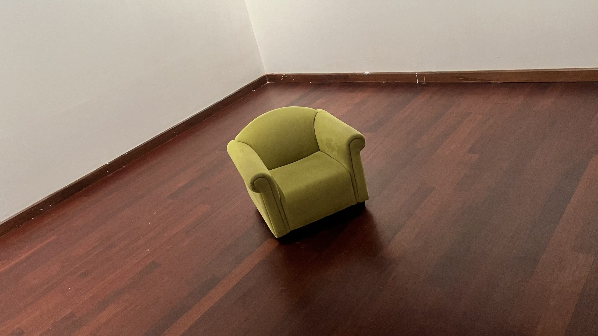
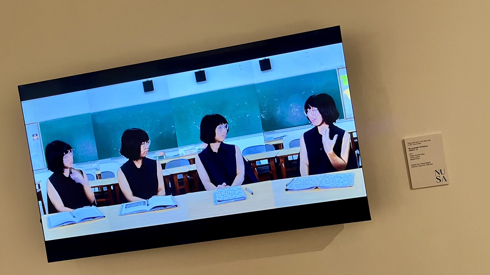

Today I walked about an hour, in ridiculous humidity, to a [wonderful contemporary gallery](https://www.artgallery.gov.my/en/homepage/) in Kuala Lumpur. The journey there was an adventure – Google had me walking under and over motorways. I got there very hot but relatively quickly!

<!-- wp:jetpack/tiled-gallery {"columnWidths":[["40.36406","19.27187","40.36406"]],"ids":[2954,2952,2953]} -->

<!-- /wp:jetpack/tiled-gallery -->

Before I had a chance to find the toilets and cool off / shake my tshirt out, I was greeted by a circular curtain of dayglow vests. This was a nice segue; my walk to the gallery was punctuated by a completely different style of road cone.

<!-- wp:jetpack/tiled-gallery {"align":"wide","columns":3,"columnWidths":[["15.87568","28.16088","15.87568","28.16088","11.92687"]],"ids":[2959,2928,2940,2929,2944]} -->

<!-- /wp:jetpack/tiled-gallery -->

The first work that grabbed me was this installation pairing a ladder and huge X, by [Samsudin Wahab](https://www.rissim.com/artists/37-samsudin-wahab/overview/). Zoom in on that X, it has excellent texture happening, as does the ladder.

I really liked the wire sculpture by [Anthony Lau](https://senishukri.blogspot.com/2012/12/anthony-lau.html). A simple idea – each wire splits in two. Effective.

The door / patterned wood sculpture is by [Ruzaika Omar Bassaree](https://padlet.com/afnastasha/ruzaika-omar-basaree-qydqwijyavkw).

<!-- wp:jetpack/tiled-gallery {"align":"wide","columns":3,"columnWidths":[["62.38299","37.61701"]],"ids":[2943,2947,2946,2945]} -->

<!-- /wp:jetpack/tiled-gallery -->

I had a lot of favourites. The texture in the table cloth and other details on this huge painting by Baharuddin Mohamed fascinted me. And also reminded me of the classic [Micro Machines computer game](https://www.theregister.com/2015/07/30/antique_code_show_retro_gaming_micro_machines/).

The simple colours and metallic sheen in [Min Wae Aung](https://www.artsy.net/artist/min-wae-aung)'s painting are amazing. You want to grab the metal cylindrical lunch box things, I bet there is some yum food inside.

[Othman Mansor](https://artfacts.net/artist/othman-mansur/67464/exhibitions)'s cabinet of surreal items pulled together melting wax/water/paint and tufts of steam clouds, a la classic surrealism.

<!-- wp:jetpack/tiled-gallery {"align":"wide","columns":3,"columnWidths":[["63.73183","36.26817"]],"ids":[2935,2936,2937]} -->

<!-- /wp:jetpack/tiled-gallery -->

These busy, black and white works by Hamdan Amirudin (boat), Gan Sze Hooi (map) and Zulkifli Mohd. Dahalan (other reality) had me fascinated.

A super cool feature of this gallery was that some works were positioned low on the wall and marked "children's eye line". There were also some tiny lounge chairs for young ones. If I was small and dragged here I would not be that bored, even before I went into the pitch-black UV-light-sensitive-painting room.

<!-- wp:jetpack/tiled-gallery {"align":"wide","columns":3,"columnWidths":[["41.26139","17.47723","41.26139"]],"ids":[2931,2933,2932]} -->

<!-- /wp:jetpack/tiled-gallery -->

This super-3D textured triptych by [Khairudin Abdul Hamid](https://www.instagram.com/kbah_art) was probably my first "favourite" of the day (*I ran out of favourite tokens*). I got lost in the detail of the reflected water and the 3D caves, reminding me of Cathedral Cove. Or any other less-famous but just as good beachside cave.

<!-- wp:jetpack/tiled-gallery {"align":"wide","columns":3,"columnWidths":[["66.74149","33.25851"]],"ids":[2942,2941,2934]} -->

<!-- /wp:jetpack/tiled-gallery -->

Here are 3 more favourites. I had to get a pic of Mohd Fazli Bin Othman's large scale painting, because it has features my current favourite road sign (bend warning chevron).

The small pics above don't do justice to these works by Phuan Thai Meng (digger, rectangles, green exploding path) and Kahlil Ibrahim (stormy ocean). Hopefully you get a chance to see these up close in person one day.

Chew Win Chen (aka [Okui Lala](https://penangartdistrict.com/okui-lala-and-the-art-of-translation/)) inspired me with her split-screen 4-way self-interview. Maybe I can use this same technique to make a more interesting electronic live performance video.

There's a lot more to this gallery. It's also a museum, I learned a lot about the explorer [Magellan](https://en.wikipedia.org/wiki/Ferdinand_Magellan) and saw a bunch of ancient science and maps – I need to find a documentary to watch and learn more!